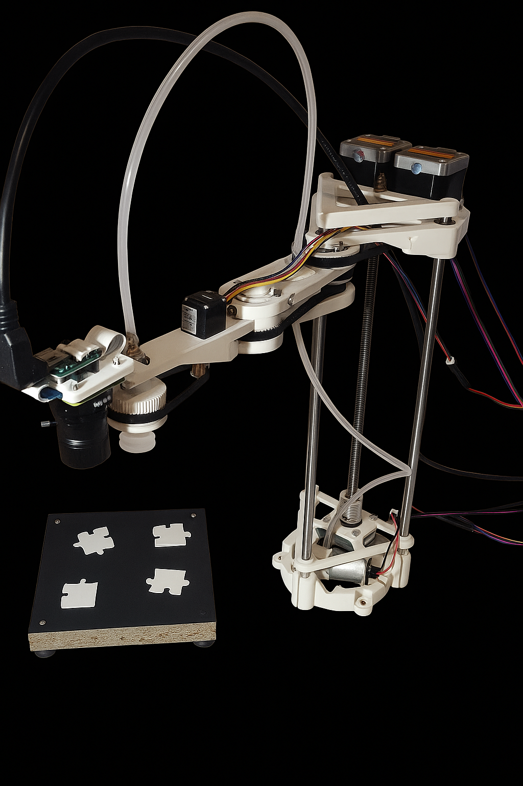

A robotic system to assemble jigsaw puzzles of variable size. The robotic arm is a SCARA-like 4 DOF manipulator, and its model is based on the Open Source project "PyBot SCARA Robotic Arm" [Hackday IO](https://hackaday.io/project/175419-pybot-scara-robotic-arm-3d-printed-python). For the purpose of the goal task, the arm models were slighty adjusted. The most important change is the forearm, that is now adjusted to mount a suction cup and a Raspberry Pi HQ Camera. 

## Prerequisities
### Software
* **Ubuntu 24.04 LTS**
* **ROS2 Jazzy**
* **OpenCV**
* **Camera_ROS** [ROS 2 node for libcamera](https://github.com/christianrauch/camera_ros)

### Hardware 
* **Raspberry Pi 5** – the main platform for ROS2.
* **Arduino Uno** – NEMA17 Stepper Motors, Suction Cup and one-way solenoid Valve.
* **Raspberry Pi HQ Camera with lense** – in order to provide minimum distortion, choose highest possible focal lenght (software was tested with 16 mm).

## Packages overview
* **puzzle_solver** – image processing package, it does all the image analysys and determines matching of elements. Provides the end data for the arm.
* **puzzle_tuner** – a tool to adjust image processing parameters.
* **scara_bringup** – contains launchfile to run the whole system in simulation or physical.
* **scara_controller** – implements `hardware_interface::SystemInterface`, providing interface between Arduino and the Raspberry Pi.
* **scara_description** – URDF/XACRO Defining robot mechanical structure. It contains STL models of the robot.
* **scara_firmware** – Arduino code (not a ROS2 package).
* **scara_kinematics** – does the Inverse Kinematics calculations. Provides separate topics for two effectors (Camera/Suction Cup).
* **scara_msgs** – provides messages definitions for topics.
* **scara_server** – action server to handle system workflow.

## Scara Task Server

The server provides three actions:

* **capture** – it moves the arm to predefined positions, to capture images of each element.
* **assemble** – requires the start&goal elements positions to be published first. The arm starts the assembly process based on this data.
* **calibrate** – similar to capture, but moves only to the first predefined position. Utilized by `tuner` node.

## Installing
This project requires ros-jazzy. If you haven't installed ROS2 yet, you can use this [link](https://docs.ros.org/en/jazzy/Installation/Ubuntu-Install-Debs.html).
To handle camera, please follow the instructions in the [ROS 2 node for libcamera](https://github.com/christianrauch/camera_ros).
To install OpenCV for ROS2, run this commands:

    sudo apt install libopencv-dev
    sudo apt install ros-jazzy-cv-bridge

## Run
Before actual assembly attempt, calibrate solver parameters using launch argument for calibration `ros2 launch scara_bringup real_robot.launch.py calibration:=true` and using sliders, adjust processing parameters for binarization and corner detection. Then, run the same command without the calibration parameter.